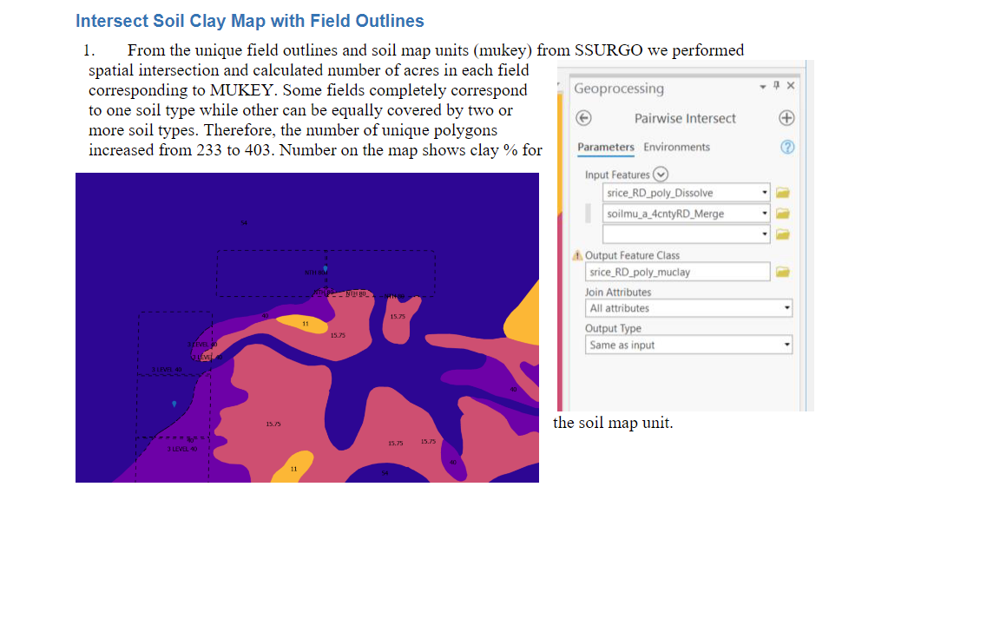

## information on collaboration with IBA to build soil clay geographical database and API interface ##

RiceTec contracted AgriTask to develop an App for farmers to certify rice farmers in SmartRice growing program. Farmer can enroll their fields each year by uploading field outlines or drawing them on the platform and entering some basic information (County name). The important part of the certification is a clay content of the whole field. The soil information is available on per County Basis from SSURGO Database from USDA (see *references* folder in this repo soils-ssurgo\references). Landviser in 2022 prepared a report, workflow and Jupyter NBs on how to obtain soil data and prepare a complete clay content map of select counties. Help/advice from IBA Group is needed for #3 and #4.

1. Download and process county soil maps for the counties growing rice where SmartRice consultant operate (see *data_in*). The data is updated annually, usually in the fall. Propose annual update service, Version control for API to RiceTec. On initial pre-delivery - agree on the list of the counties included. If grower comes from the additional county mid-year - mechanism to add processed soil data for a new county should be planned. 

2. Calculated clay content geolayer (Python script mukey_prc_clay.ipynb) 
   - [ ] is a base for Landviser API - need to authomate script to process many counties at once - write a custom function(s)

3. Hosting of Clay API geodatabase? PostgreSQL on Linux? (IBA Advice?)
- a. AWS - free tiers? 
- b. ArcGIS Developer https://developers.arcgis.com/pricing/ - LandviserAI https://g-eo.maps.arcgis.com/home/index.html is ESRI Business Partner
- c. A2 unlimited hosting - with Python capabilities (Turbo) https://www.a2hosting.com/web-hosting/compare - is paid for and available to test

4. How to interface with Agritask API (see their documentation in this folder) so once the field is drawn in AgriTask app, it hits Landviser Clay API, calculates a spatially weighted average of clay content under the field footprint and serves just one number per field as TOTAL CLAY CONTENT % of top 50 cm back to AgriTask App. This will involve geographic (spatial) intersection of two shapes with some GIS calculations on Landviser's API side. ArcGIS online has those geoprocessing capabilities, so the least difficult approach would be 3.b - at least initially for prototyping...
   - [ ] research AgriTask API and prepare clay layer for the test farm fields
   

### Test farmer access to AgriTask App

Dear Larissa,

A new user has been created for you on the AgriTask platform.
Your username is "larisa@landviser.com".

Please click on the link below to create your password for your comfort and security.

http://ricetec.agritask.com/r/main/reset_password?uuid=72167232505905153 - password reset to "ask Larisa for Password if want to test farmers' interface"

After creating your password, you will be able to access both our Web and mobile applications.
Please note that the link will expire after 168 hours, and it can be renovated by the responsible manager if needed.

After you create your password, please also download and access the AgriTask Android app, click on the link below and download our app.
The username and password are the same as those used on the web.
Download our mobile app

If you need our support, please send an e-mail to support@agritask.com.
Kind regards,
Agritask team
